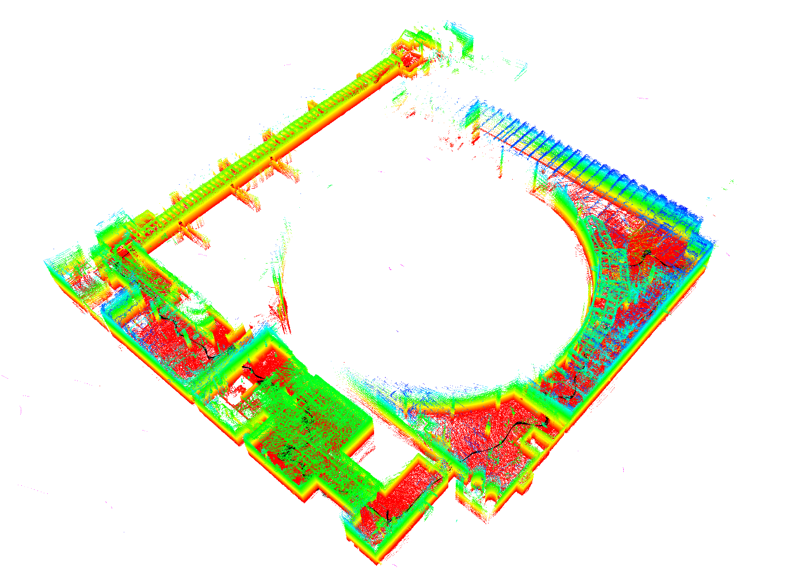
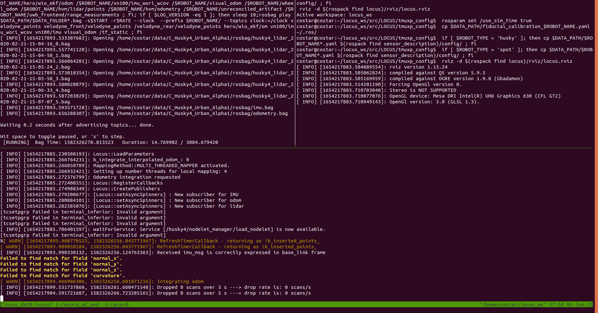
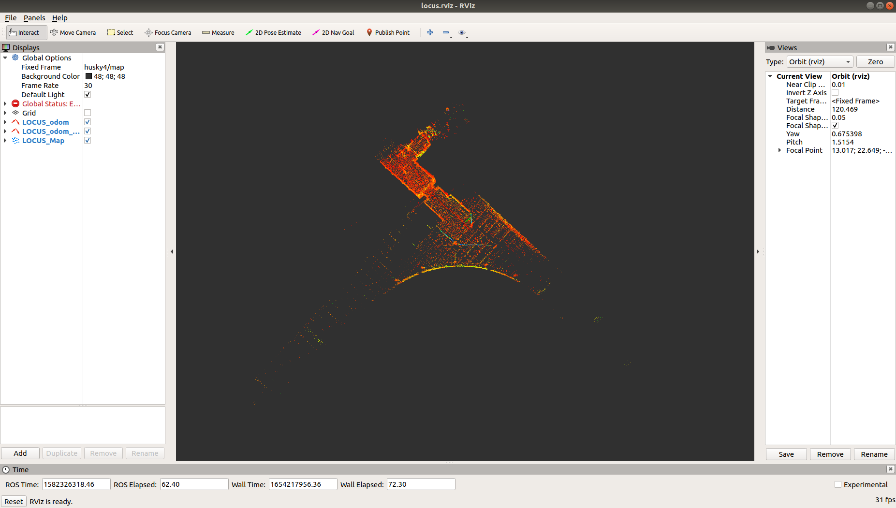

# LOCUS

LOCUS (Lidar Odometry for Consistent operation in Uncertain Settings) is a Multi-Sensor Lidar-Centric Solution for High-Precision Odometry and 3D Mapping in Real-Time.



# Build Instructions

Install [ROS](http://wiki.ros.org/ROS/Installation)

Install catkin tools
```
sudo apt-get install ros-kinetic-catkin python-catkin-tools python3-catkin-tools
```

Install PCL 
```
sudo apt-get install ros-melodic-pcl-ros # for the melodic distro - Ubuntu 18.04
sudo apt-get install ros-noetic-pcl-ros # for the noetc distro - Ubuntu 20.04
```

Install `tf2_sensor_msgs`  and `tf2_geometry_msgs`
```
# for the melodic distro - Ubuntu 18.04
sudo apt install ros-melodic-tf2-sensor-msgs 
sudo apt install ros-melodic-tf2-geometry-msgs 
# for the noetic distro - Ubuntu 20.04
sudo apt install ros-noetic-tf2-sensor-msgs 
sudo apt install ros-noetic-tf2-geometry-msgs 
```

Build this package in a catkin workspace, e.g. 

```bash
mkdir -p catkin_ws/src
cd catkin_ws
catkin init
catkin config -DCMAKE_BUILD_TYPE=Release 
cd src
git clone git@github.com:NeBula-Autonomy/LOCUS.git
catkin build locus
```

Add the workspace sourcing to your bashrc (changing the filepath to match where your catkin workspace is)
```
echo "source ~/catkin_ws/devel/setup.bash --extend" >> ~/.bashrc
```


## Install tmuxp (for our running scripts)
tmuxp is a python wrapper for tmux allowing easy launching of multi-window, multi-tile tmux sessions.
```
sudo apt install tmuxp
```


## Install Clang formatting
For development, setup clang formatting for the repo

```
cd locus
./scripts/clang_setup/clang_setup.sh
```

This will install clang and put a pre-commit hook to maintain clang formatting. To force clang formatting on edited files, use:

```
git clang-format -f
```


# Running Instructions
This example is given for our open source datasets that come with ground truth:
https://github.com/NeBula-Autonomy/nebula-odometry-dataset

There are many datsets there to test on, across a range of environments and with data from different robotic platforms. 

Here, we give an example from dataset C, from a Husky Robot in the Statsop Power Plant, but the same steps apply for any other dataset we have released. 

Note: the steps for running LOCUS live on the robot is no different from running on a dataset - the datasets are run and processed in real-time.

## Download dataset

Download data from here: https://github.com/NeBula-Autonomy/nebula-odometry-dataset/blob/main/pages/dataset.md
1. Download the rosbag data for dataset C: https://nextcloud.robotics.caltech.edu/index.php/s/6QNKyLN85WqN9Rd - this will be approximately 45.8 GB (out smallest dataset)
2. Download the Extras: https://nextcloud.robotics.caltech.edu/index.php/s/TyoFS93rRo5rgXa

Place the data in a common folder, e.g. 
```
mkdir -p ~/data/C_Husky4_Urban_Alpha1  
mv ~/Downloads/C_Husky4_Urban_Alpha1_rosbag ~/data/C_Husky4_Urban_Alpha1/rosbag
mv ~/Downloads/C_Husky4_Urban_Alpha1_extra/* ~/data/C_Husky4_Urban_Alpha1/
```

i.e. have a root folder, with the bagfiles in a rosbag folder, and the other files in the root folder. The result should look something like:

```
/home/nebula/data/
└── C_Husky4_Urban_Alpha1
    ├── fiducial_calibration_husky4.yaml
    ├── h4_a1_gt_map.pcd
    ├── h4_a1_gt_map.ply
    ├── husky4_sensors.yaml
    ├── odometry.bag
    └── rosbag
        ├── imu.bag
        ├── odometry.bag
        ├── husky4_lidar_2020-02-21-15-04-16_0.bag 
        ├── husky4_lidar_2020-02-21-15-04-50_1.bag
        ├── ...
```

See https://github.com/NeBula-Autonomy/nebula-odometry-dataset/blob/main/pages/dataset.md for an explanation of what each file is. 

## Edit the tmux script 
Edit our tmux running script `LOCUS/tmuxp_config/run_locus.yaml` and modify the filepaths for your system. From the `main` branch, you should only need to modify the `DATA_PATH`

- `DATA_PATH` - to point do your data folder, e.g. `/home/nebula/data/C_Husky4_Urban_Alpha1`

For other datasets, you will need to modify other parameters, such as:
- `ROBOT_NAME` and `ROBOT_TYPE` to match the dataset, e.g. `husky4` and `husky`
- `RUN_NUMBER` to create a unique folder name for the output data to be stored

Other parameters are explaing in the yaml file. 


## Run the test 

Start a roscore in one terminal
```
roscore
```

Run the tumxp script in another terminal 
```
tmuxp load {path_to_locus}/LOCUS/tmuxp_config/run_locus.yaml
```

You should see a tmux paned terminal that looks something like:



And RViz should open, eventually giving you something looking like:




## Output data
At the end of the run, go to the third tmux window (`ctrl + b`, then `n` to cycle windows) and hit enter on the last pane (`ctrl + b` then arrow keys to navigate panes) to execute `rosnode kill -a` to stop all the bag recordings (will also kill RViz and locus).

To kill the tmux session, enter `tmux kill-session`.

The tmux script will store output odometry, map and stats in a new folder `locus_$RUN_NUMBER` in the root folder of the dataset. For example, the resulting folder should look like:

```
└── C_Husky4_Urban_Alpha1
    ├── fiducial_calibration_husky4.yaml
    ├── h4_a1_gt_map.pcd
    ├── h4_a1_gt_map.ply
    ├── husky4_sensors.yaml
    ├── locus_test_01
    ├── odometry.bag
    │   ├── delay.txt
    │   ├── lidar_callback_duration.bag
    │   ├── odometry.bag
    │   ├── rate.txt
    │   ├── scan_to_map_duration.bag
    │   ├── scan_to_scan_duration.bag
    │   └── stationary.bag
    └── rosbag
        ├── husky4_lidar_2020-02-21-15-04-16_0.bag
        ├── ...
```


## Running on other NeBula datasets
See other tmuxp configs for each of our datasets in the `LOCUS/tmux_config/nebula_odometry_dataset` folder.

Note that the sensor configurations are not the same for every dataset (they are included in the `extra` folder), even if the robot name is the same. The tmuxp script handles copying the sensor config (e.g. `husky4_sensors.yaml`) into LOCUS. Having the wrong sensor config will lead to poor results. 

The tmuxp script also copies the fiducial calibration file (e.g. `fiducial_calibration_husky4.yaml`), which gives the correct initial position to match the ground truth odometry. If this is not updated, the initial pose will be wrong. If it does not exist in your `~/.ros` folder, the robot will start at the origin with zero rotation. This only matters if you want to compare to our ground truth. 


# Running LOCUS on your own datasets / Robot


To do 


# TODOS

- [x] Rename all lo_frontend instances to locus
- [ ] Cleanup comments, the less the better, just keep the very relevant ones
- [ ] Cleanup unused parameters, class variables, publishers and subscribers 
- [ ] Bring in MDC in launch
- [ ] Remove filter_.Filter call in LidarCallback as nothing is being filtered internally anymore and remove point_cloud_filter package accordingly
- [ ] Simplify our robot-specific files for a generic robot (e.g. no husky/spot anymore) and define how you want to let the user load sensor extrinsic, either hardcoded or by TF
- [ ] Suggest parameters for open/closed space in yaml where relevant (e.g. PointCloudOdometry, PointCloudLocalization)
- [ ] Update README.md with instructions on how to setup/run the package


# Cite
If you use this code, or compare to it in your work, please cite the following:

```
@article{reinke2022iros,
  title={LOCUS 2.0: Robust and Computationally Efficient LiDAR Odometry for Real-Time Underground 3D Mapping},
  author={Andrzej Reinke, Matteo Palieri, Benjamin Morrell, Yun Chang, Kamak Ebadi, Luca Carlone, Ali-akbar Agha-mohammadi},
  journal={TODO},
  year={2022},
  publisher={TODO}
}
```

```
@article{LOCUS,
  title={{LOCUS} - {A} {M}ulti-{S}ensor {L}idar-{C}entric {S}olution for {H}igh-{P}recision {O}dometry and 3{D} {M}apping in {R}eal-{T}ime},
  author={Palieri, Matteo and Morrell, Benjamin and Thakur, Abhishek and Ebadi, Kamak and Nash, Jeremy and Chatterjee, Arghya and Kanellakis, Christoforos and Carlone, Luca and Guaragnella, Cataldo and Agha-mohammadi, A.},
  journal={IEEE Robotics and Automation Letters},
  volume={6},
  number={2},
  pages={421--428},
  year={2020},
  publisher={IEEE}
}
```


# Old 


# Prerequisites

`tf2_sensor_msgs` may not be installed by default, so install with:
```
sudo apt install ros-$(rosversion -d)-tf2-sensor-msgs
```

# Testing in Ubuntu 20.04 on Dell Precision 


### ROS Install summary
http://wiki.ros.org/noetic/Installation/Ubuntu
```
sudo sh -c 'echo "deb http://packages.ros.org/ros/ubuntu $(lsb_release -sc) main" > /etc/apt/sources.list.d/ros-latest.list'
sudo apt install curl # if you haven't already installed curl
curl -s https://raw.githubusercontent.com/ros/rosdistro/master/ros.asc | sudo apt-key add -
sudo apt update
sudo apt install ros-noetic-desktop
```

Source ros to bashrc
```
echo "source /opt/ros/noetic/setup.bash" >> ~/.bashrc
```

Ros build tools 
```
sudo apt install python3-rosdep python3-rosinstall python3-rosinstall-generator python3-wstool build-essential
sudo apt install python3-rosdep
sudo rosdep init
rosdep update
```
