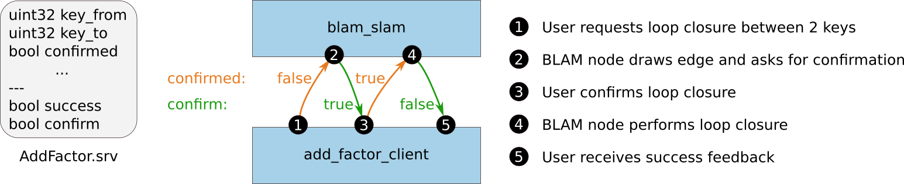

# Tools for BLAM

This module contains scripts to help debug BLAM.

Always source your `internal/devel/setup.bash` (or `internal/devel_isolated/setup.bash`) before running the Python nodes. The `blam_slam` ROS node must be running while executing any of the following services.

This package requires the Python package `Transforms3d`, which can be installed via

```sh
pip install transforms3d
```

## add_factor.py

Allows the user to add a `BetweenEdge` to the graph that connects two keys in the isam2 pose graph.

```sh
python add_factor.py key1 key2
```

`key1` and `key2` are unsigned integers that represent the keys of the two pose graph nodes to be connected.

Once the request has been made, the factor to be added is visualized by a yellow edge connecting the two keys (red spheres visualize these nodes). The user needs to confirm by entering `y` or `yes` into the console and press return, or abort the operation by entering `n` or `no`. The message passing flow is as follows:



It is furthermore possible to define the attitude of the pose which is used to initialize the loop closure
optimization via the following parameterizations: (yaw is around the z axis)

```sh
python add_factor.py <from_key> <to_key> <yaw> <pitch> <roll>
```

Creates a loop closure between keys from_key and to_key with a rotation defined by
the given yaw, pitch and roll angles in radians.

```sh
python add_factor.py <from_key> <to_key> quat <w> <x> <y> <z>
```

Creates a loop closure between keys from_key and to_key with a rotation defined by
the given quaternion coordinates w, x, y, z in radians.

```sh
python add_factor.py <from_key> <to_key> axis <angle> <x> <y> <z>
```

Creates a loop closure between keys from_key and to_key with a rotation defined by
a rotation about axis x, y, z by an angle in radians. The axis coordinates need not
be normalized.

```sh
python add_factor.py <from_key> <to_key> euler <a> <b> <c> [spec="szyx"]
```

Creates a loop closure between keys from_key and to_key with a rotation defined by
the given Euler angles about axes a, b, c in radians following the angle specification.
This specication is a string that follows the convention in http://matthew-brett.github.io/transforms3d/reference/transforms3d.euler.html#specifying-angle-conventions.

> By default, spec is defined as "szyx" which is the Tait-Bryan notation,
> also known as Cardan angles.
> Another common spec is "rzxz" which is outlined in http://mathworld.wolfram.com/EulerAngles.html.

While the service is executed, the current state of the factor graph will be saved to a log file to `~/Desktop/factor_graph.txt`.

## remove_factor.py

Allows the user to remove a `BetweenEdge` from the graph that connects two keys in the isam2 pose graph.

```sh
python remove_factor.py key1 key2
```

`key1` and `key2` are unsigned integers that represent the keys of the edge to be removed.

Once the request has been made, the factor to be removed is visualized by a yellow edge connecting the two keys (red spheres visualize these nodes). The user needs to confirm by entering `y` or `yes` into the console and press return, or abort the operation by entering `n` or `no`. The message passing flow is analogous to the above.

## save_graph.py

Allows the user to save the entire pose graph, including all point clouds attached to it, to a zip file.

```sh
python save_graph.py filename.zip
```

`filename.zip` is the path of the zip file which should be generated. Watch the output of the `blam_slam` ROS node for any error messages, or to learn the absolute path of the file that was generated. If a relative path name is given, it is typically saved with respect to the folder `~/.ros/`.
