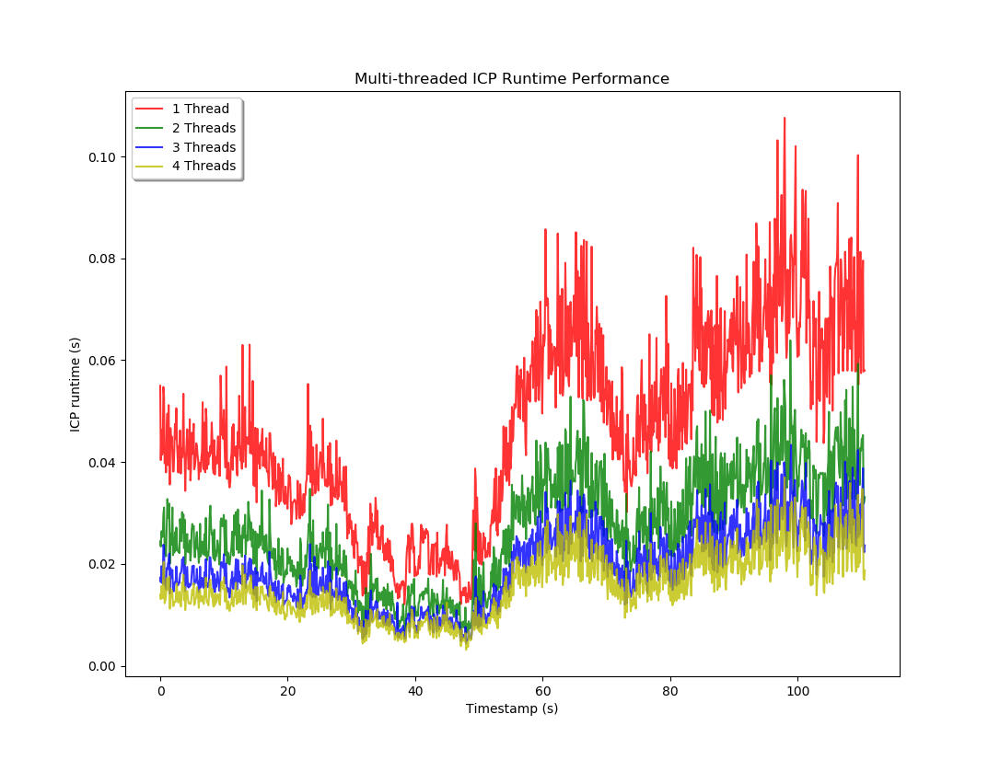
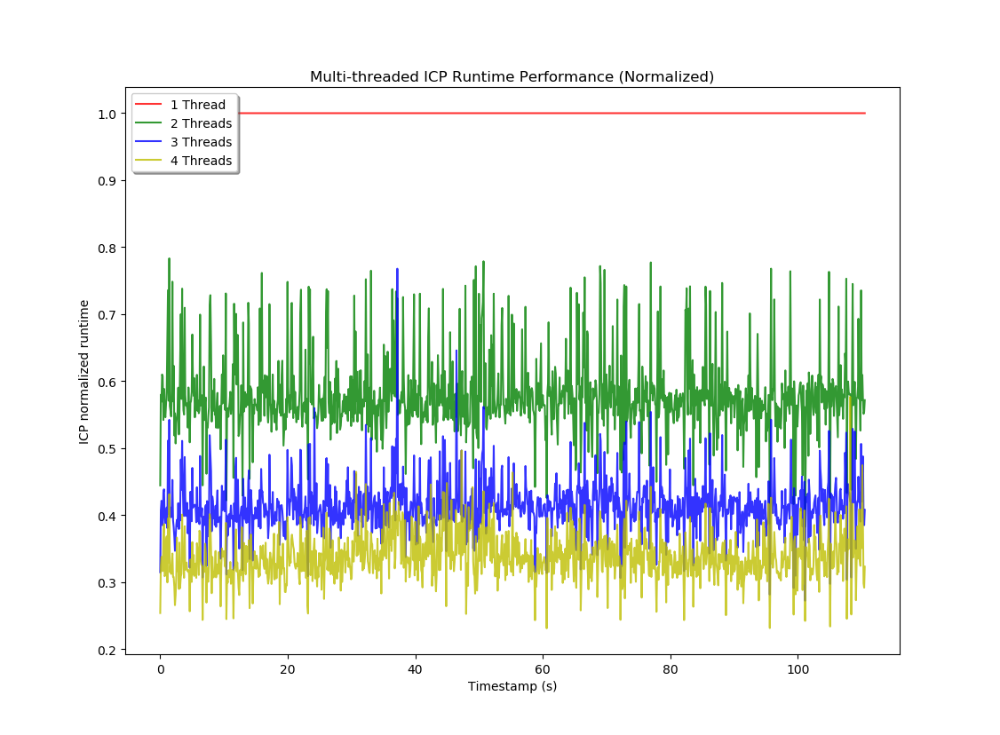

# Multithreaded Generalized Iterative Closest Point (GICP)

This library is a multithreaded implementation of GICP from PCL. The output is identical to regular GICP, but the algorithm runs faster when you allow it to use more threads (almost N times faster, where N is the number of threads). Both the surface normal (covariances) estimation and the nearest neighbor lookups in the iterative section are parallelized. The main differences from the PCL GICP implementation are the following:

To set the number of threads, call: icp.setNumThreads(num_threads) 

To enable log messages related to timing, call: icp.enableTimingOutput(true)

There is a test included in the test folder to verify that GICP's output remains the same, regardless of the number of threads used.

